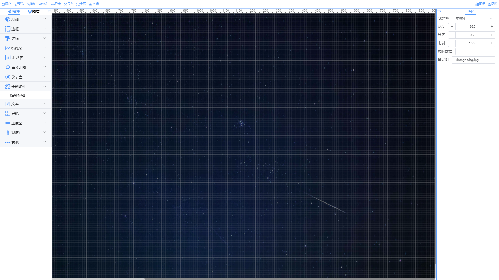
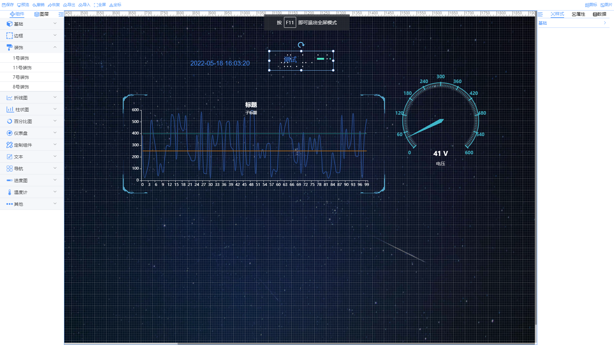

# OpenDataV

OpenDavaV 是仿照阿里 DataV 开发的一款拖拽式低代码大屏应用，采用 `Vue3` + `vite` + `typescripts` 开发，目前项目在完善中,暂不接收需求...


## 实现的功能

- 页面布局的编辑、预览、快照、自定义页面大小、页面文件的导入导出
- 图层的拖动、置顶、置底、上下移动、显示、隐藏
- 组件的缩放、旋转、拖动、复制、粘贴、组合、拆分、自动对齐
- 支持自定义组件的动态加载
- 支持历史记录保存、撤销

## 部分截图





## 预览

【预览地址】：https://ansgoo.github.io/openDataV/#/page/create

本项目有个简单的后端项目，用于用户页面存储,采用`Koa`+`Typescripts`开发，地址：[https://github.com/AnsGoo/DataVStore](https://github.com/AnsGoo/DataVStore)

## 启动项目

```shell
git clone git@github.com:AnsGoo/openDataV.git
# 安装依赖
pnpm install -r
pnpm dev
```

## 打包

```shell
pnpm build
```