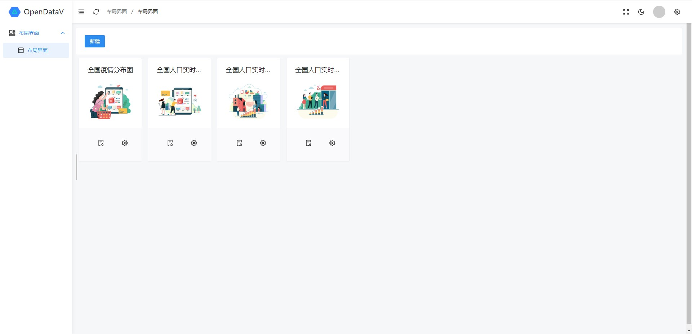
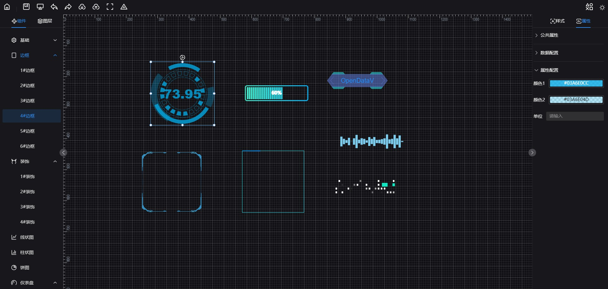

# 简介
  🎃OpenDataV 是一个纯前端的`拖拽式`、`可视化`、`低代码`数据可视化🌈开发平台，你可以用它自由的拼接成各种✨炫酷的大屏，同时支持用户方便的开发自己的组件并接入平台。

# 体验
🧙国外：[http://datav.byteportrait.com/](http://datav.byteportrait.com/)

🧙国内：[http://small_bud_star.gitee.io/datav](http://small_bud_star.gitee.io/datav)

# 源码地址：

🍨github:[https://github.com/AnsGoo/openDataV](https://github.com/AnsGoo/openDataV)

🍨gitee:[https://gitee.com/small_bud_star/DataV](https://gitee.com/small_bud_star/DataV)

gitee 仅做代码同步，issues或者RP请在github提交。

目前该项目在不断的完善中，🎉欢迎issuer,🌹欢迎start, 🎨欢迎commit, 🚀欢迎use...，💪欢迎一切技术交流活动

### 🎛️ 布局页


### 🤿 编辑页
 

# 功能
- 🎊 编辑器页面基本功能完成，包括编辑、预览、导入、导出、保存
- 🪄 图层的置顶、置底、上下移动、显示、隐藏、复制、剪切、粘贴
- 🖼️ 组件的缩放、旋转、拖动、复制、粘贴、组合、拆分、移除、自动对齐
- 🔮 支持用户操作记录的恢复、撤销功能
- 🧶 支持用户自定义组件
- 📔 支持组件的用户自定组件配置项
- 🏪 支持明暗主题切换
- 🧬 使用Monorepo模式进行组件和依赖管理

# 技术点
本项目采用`Vue3` + `vite` + `TypeScript`开发，界面库使用`NaiveUI`，使用面向对象方式封装了路由、请求、存储，组件采用自动扫描注册、异步加载，提升渲染速度；使用IndexDB存储快照数据，减少快照数据内存占用，加快访问速度；组件独立依赖，解耦了组件和基础框架的依赖库，方便后续独立开发组件。

目前仅开发了部分组件，后续还会继续完善。

### ⌛计划功能
- [ ] 组件动态、静态数据加载
- [ ] 数据动态处理（JS、Python）
- [ ] 项目发布
- [ ] 接口管理
- [ ] 算法管理
- [ ] HTTP、 WebScoket、MQTT、SocketIO多种数据接口适配
- [ ] 代码生成

# 开发环境
| 名称 | 版本    |
| ---- | ------- |
| node | 16.14.x |
| pnpm | 7.9.3   |
| vue  | 3.2.20  |

🚥目前仅在`Chrome`和`Microsoft Edge`最新版浏览器测试过，其他浏览器未测试

# 启动项目

```shell
# 安装依赖
pnpm install -r

# 运行项目
pnpm dev

# 打包项目
pnpm build
```

## ☎️联系方式

**注：技术交流，请加群**


**更新动态请关注公众号**


