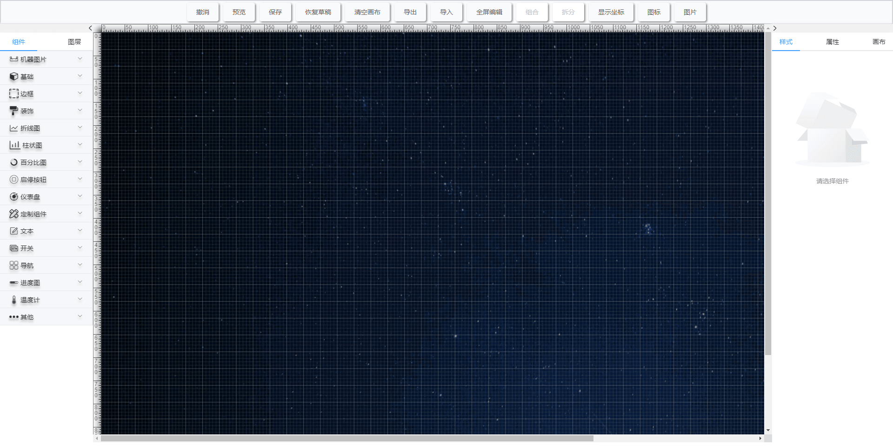
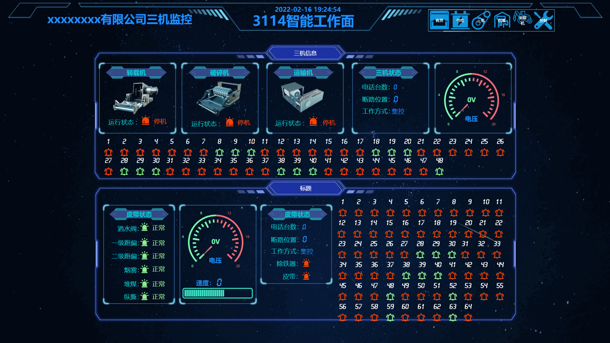
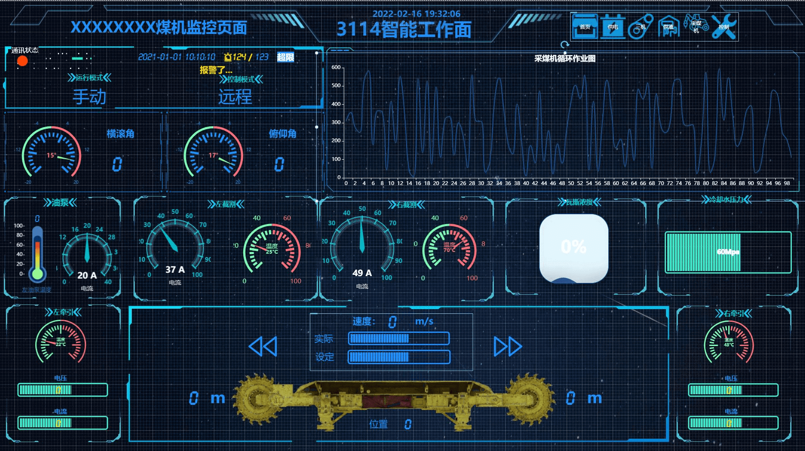

# OpenDataV

OpenDavaV 是仿照阿里 DataV 开发的一款拖拽式大屏应用，采用 `Vue3` + `vite` + `typescripts` 开发，目前项目在完善中,暂不接收需求...

## 实现的功能

- 页面布局的编辑、预览、自定义页面大小、页面文件的导入导出
- 图层的拖动、置顶、置底、上下移动
- 组件的缩放、拖动、复制、粘贴、组合、拆分、自动对齐
- 支持自定义组件的动态加载

## 样图

- 编辑页面



- 大屏效果1



- 大屏效果2



## 预览地址：

[https://ansgoo.github.io/openDataV](https://ansgoo.github.io/openDataV)

可下载 `templates` 文件夹下的`JSON`文件，点击编辑器导入预览已生成的项目

本项目有个简单的后端项目，用于用户页面存储,采用`Koa`+`Typescripts`开发，地址：[https://github.com/AnsGoo/DataVStore](https://github.com/AnsGoo/DataVStore)

## 启动项目

```shell
git clone git@github.com:AnsGoo/openDataV.git
# 安装依赖
yarn
yarn dev
```

## 
