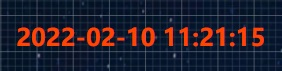

# 时间文本（`DateText`）

> 展示一个实时变动时间文本，主要用于页面时间展示

## 版本信息

|组件版本|平台版本|说明|
|:---:|:---:|:---:|
|1.0|{{ $frontmatter.platform }}|可用|

## 属性

### 基础属性

|配置项|作用|说明|
|:---:|:---:|:---:|
|`格式`|时间格式||

## 样式

### 字体设置

|配置项|作用|说明|
|:---:|:---:|:---:|
|`颜色`| 文字颜色，支持16进制和RGBA颜色表示方法||
|`字体大小`|字体大小||
|`字体宽度`|字体宽度|100-900，必须是100的整倍数|
|`字体`|字体名称|保证该字体在本机上存在，否则采用浏览器默认字体|

## 示例

- 效果图

- 属性配置

> 基础属性

|组|属性|值|
|:---:|:---:|:---:|
|基础属性| `自定义文本`|icon-falling|

- 样式配置

|组|属性|值|
|:---:|:---:|:---:|
|字体设置| `颜色`|rgba(255, 69, 0, 1)|
|字体设置|`字体大小`|24|
|字体设置|`字体宽度`|800|