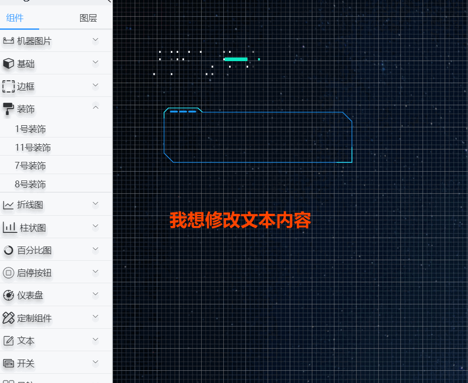
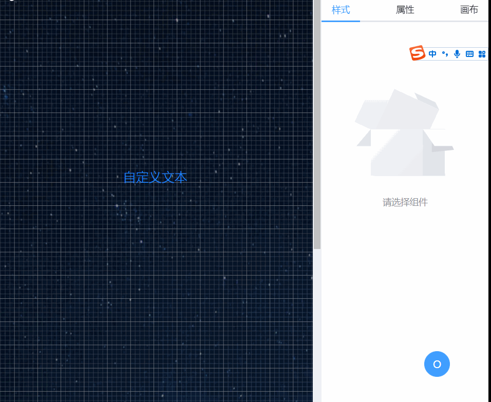
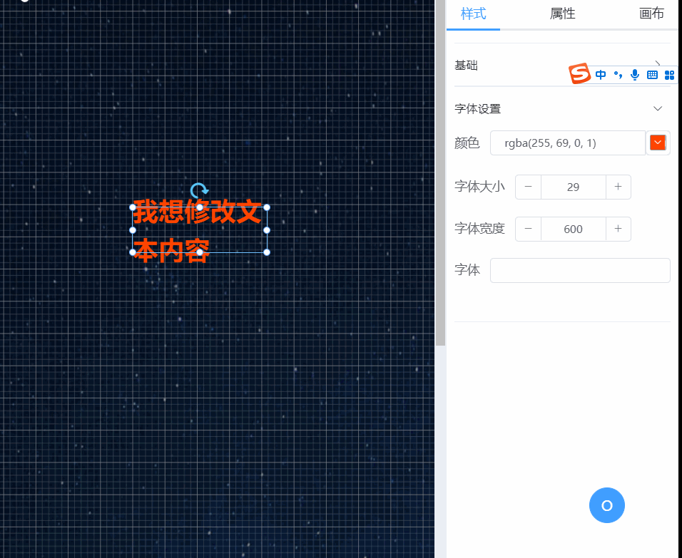
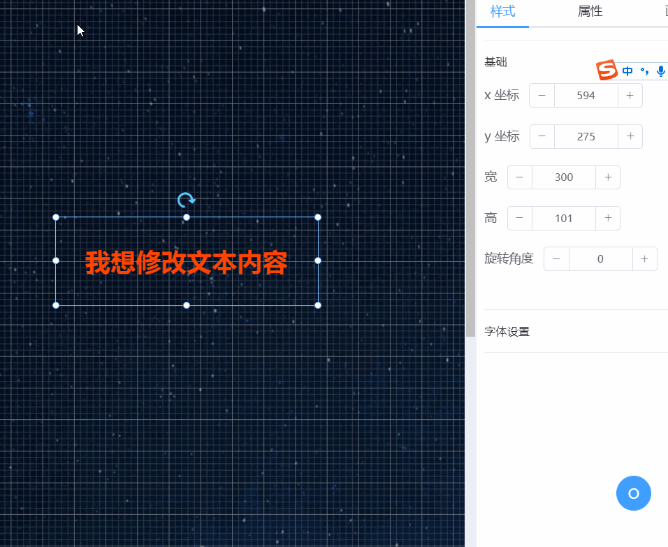
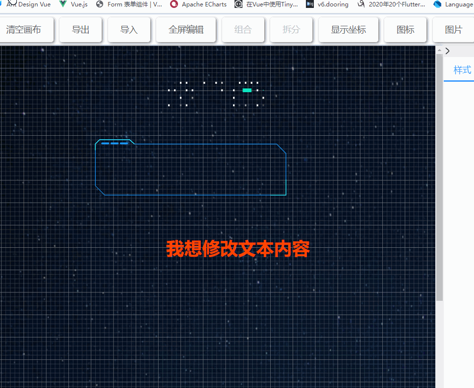
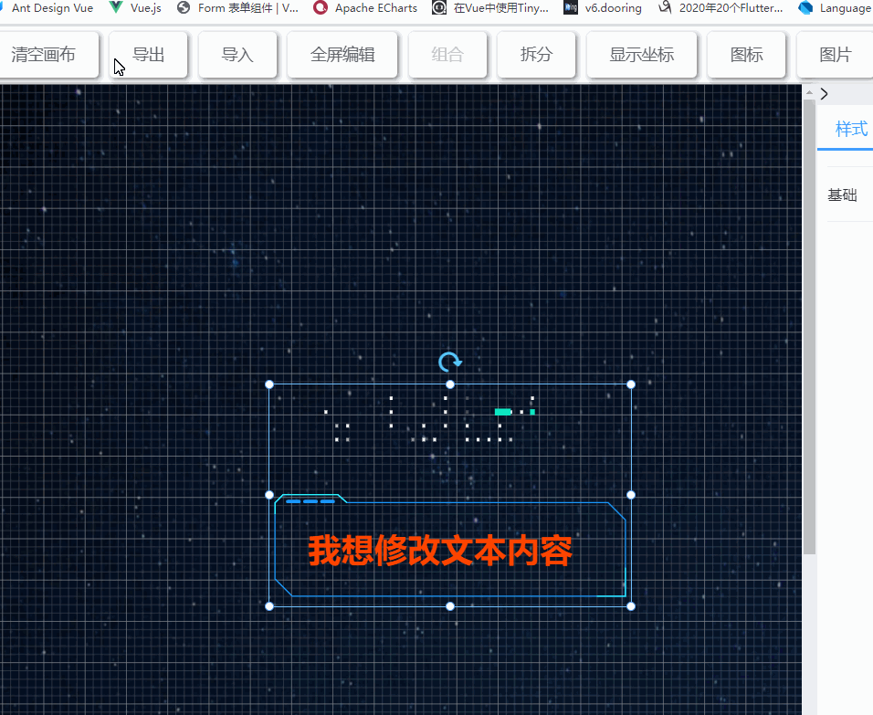
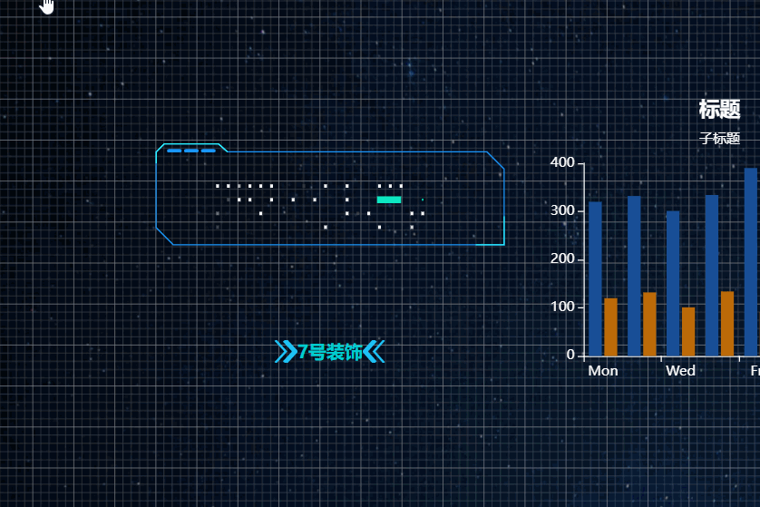
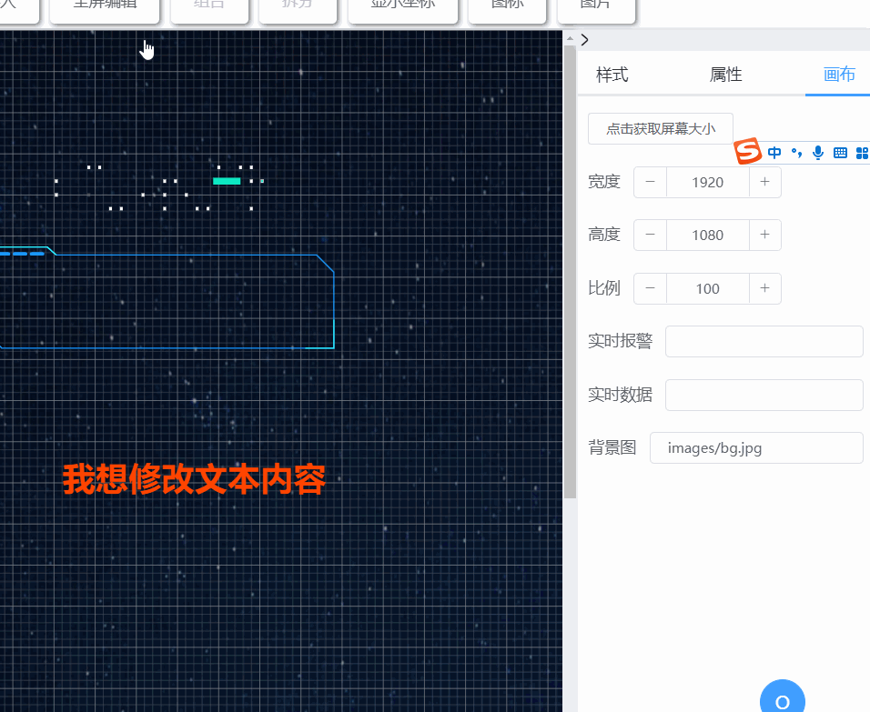
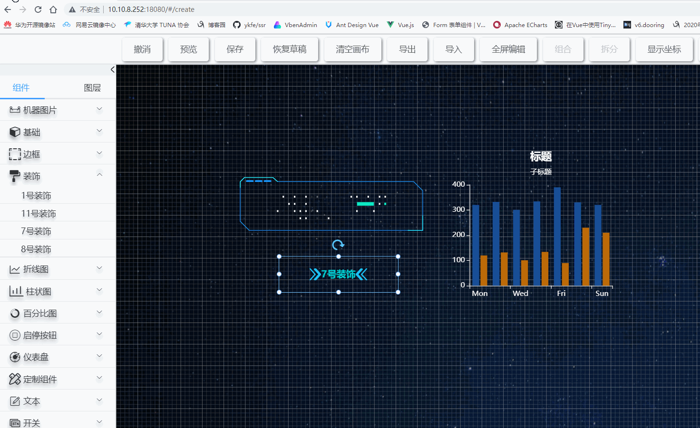
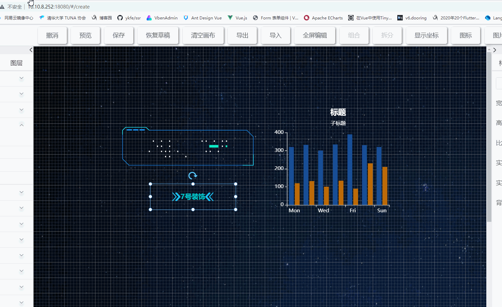

# 创建页面

管理页面的点击`+`会进入我们的设计器里面，在这里我们可以创建一个新的页面

创建页面最顶部为`工具栏`，包含了常用的`组合`、`拆分`、`恢复`、`清空`、`预览`、`撤销`、`保存`、`导入`、`导出`、全屏编辑等功能

左侧栏主要包含了`组件`和`图层`两个工具栏，`组件`为可拖拽的组件，`图层`主要为拖拽到画布的组件

右侧栏主要包含了`样式`、`属性`和`画布`，`样式`和`属性`为组件的功能，当你选中某个组件时，可通过`样式`和`属性`编辑组件，`画布`为整个`画布`的属性

中央为画布区，可将组件拖到画布上来绘制我们的画布

# 向画布添加组件

# 移除组件

# 修改组件属性

# 拉伸组件

# 旋转组件

# 组合多个组件

组合组件有两种方式：

1. 组合组件和通过鼠标左键点击画布，然后移动才设定选中区域，这样该区域内的所有组件都会被选中，选中多个组件之后点击组合按钮进行组合

2. 通过`Ctr`+`鼠标左键`单击组价，依次来选中多个组件进行组合

多个组件组合之后会生成一个组组件

# 拆分组件

只要是组组件都可以进行拆分，组组件拆分完成之后就变成一个个子组件

# 改变组件图层位置

图层的级别决定了组件渲染顺序， 图层级别越低的组件越靠近页面里面，图层级别越高的组件越靠近页面外面，而各种交互事件只能触发在最外层的组件上，因此图层的级别不仅关系者页面样式更关系着交互事件是否能触发

# 修改画布属性

# 预览页面

# 保存页面

