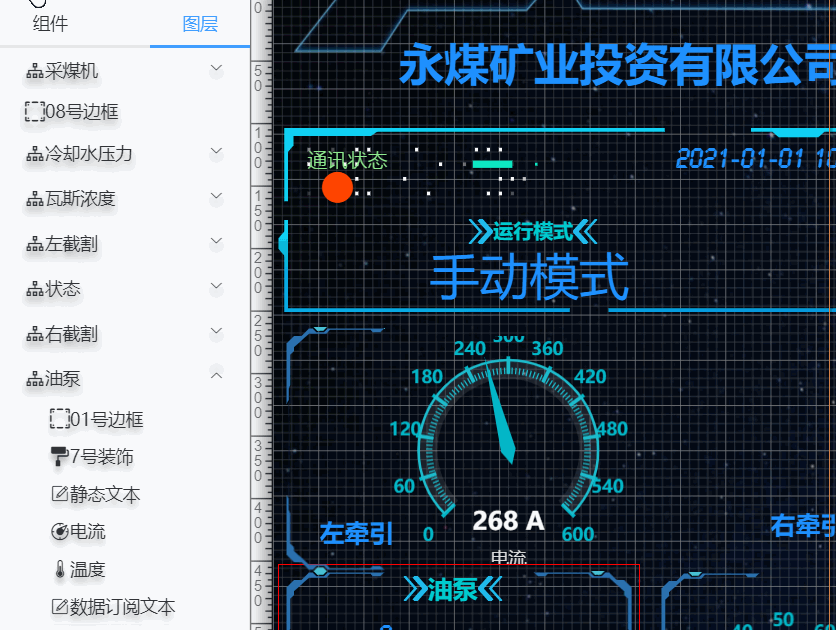

# 编辑页面

点击编辑按钮进入编辑页面，可编辑我们已经设计好的页面。

对于一个复杂页面，各个组件相互重叠、组合，我们已经不能单纯的通过单击选中我们需要的组件了，因此面对一个复杂页面我们如何选中我们所需要的组件，这是页面编辑的基础。在这里我们可以通过图层来完成

这里我们以一个页面为例

# 通过图层来选中组件

我们想选中采煤机的运行状态，并修改他的显示文本

# 图层重命名

通常图层按照层级分布，图层的名称默认是组件名称，为了我们方便定位。通常我们鼓励用户在开发过程中根据实际情况，言简意赅的重命名图层

# 修改组组件的子组件位置属性

通常我们可以通过修改组件的`坐标`和`长宽`属性来改变组件`大小`和`位置`，但是组合组件的子组件的`大小`和`位置`是相对父组件的，因此，子组件修改`大小`和`位置`，在不拆分的情况下，修改的是`相对坐标`和`相对大小`

# 改变图层位置

我们经常遇到鼠标点击按钮不起作用，Echart 图无法响应鼠标事件， 输入框无法输入等问题，这是因为你的组件图层太低，上面的图层遮挡住各种交互事件，所以对于有交互事件的组件通常要求该组件置顶

我们也可以通过左侧栏图层，改变图层位置

