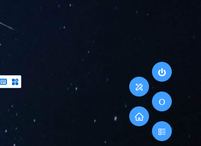
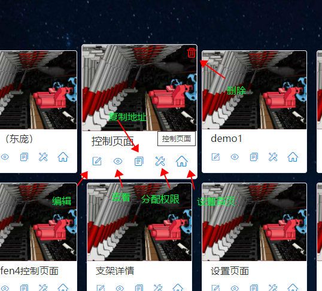

# 页面管理

我们在这里提供了简单的页面管理，包括`认证`、`权限`、`删除`、`编辑`、`创建`、`设置主页`、`查看`等操作,除过查看权限以外，其他操作均需要用户认证之后才开可以操作

## 认证

请访问`/login`页面进行认证操作

我们内置了三个用户,三个用户的密码详细请咨询平台服务人员

| 用户名 |     密码     |                      权限                      |
| :----: | :----------: | :--------------------------------------------: |
| admin  | **\*\*\*\*** | `创建`、`编辑`、`删除`、`设置主页`、`配置权限` |
|  ops   | **\*\*\*\*** | `创建`、`编辑`、`删除`、`设置主页`、`配置权限` |
| super  | **\*\*\*\*** | `创建`、`编辑`、`删除`、`设置主页`、`配置权限` |

登录完成之后在`非单页面查看页面`右下角会出现一个固定钉，这是我们网站的快捷按钮

通过这个按钮我们可以很方便的在`首页`、`管理页面`、`系统设置页面`进行跳转，并进行登出操作

## 页面管理

请访问`/pages`页面查看我们创建的所有页面，同时在这个页面上对已创建的页面进行管理

对每一个页面你可以`编辑`、`查看`、`分配权限`、`设置首页`、`删除`、`复制地址`等操作

点击`+`号可创建一个新的页面

