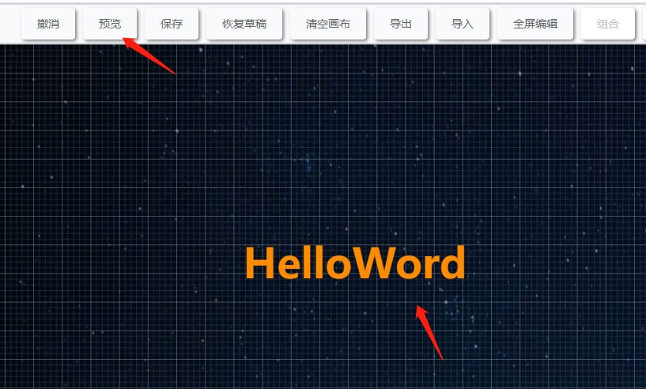
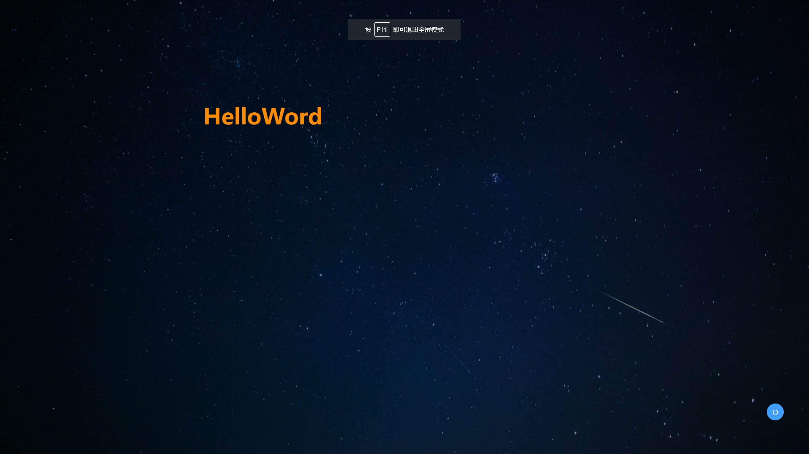
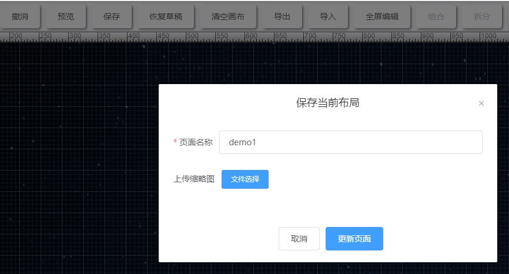
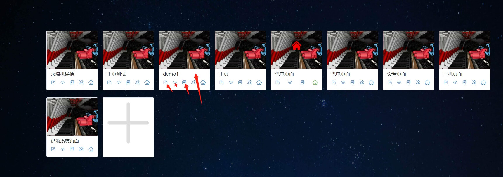

[toc](目录)

# 预览并发布

完成页面的设计，我们尝试预览一下效果，如果满意我们可以发布

## 预览

点击设计器的预览按钮，则会打开有一个新的页面展示你我们的设计效果

并按下`F11`键，可在全屏下展示

## 发布

也可以点击发布按钮，将设计页面进行发布，与预览不同的是，发布需要输入页面名称，并且会将页面数据存入数据库

当然你也可以进入管理页面，对刚才设计的页面进行管理(`编辑`、`删除`、`配置`、`设为主页`、`复制访问地址`、`查看`)

