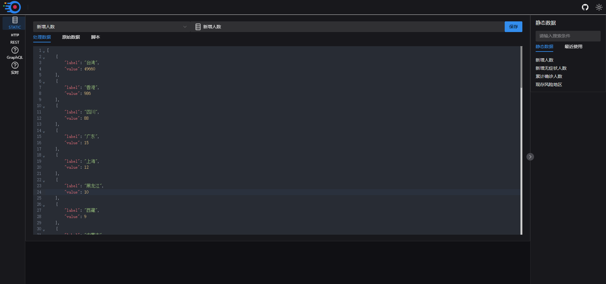
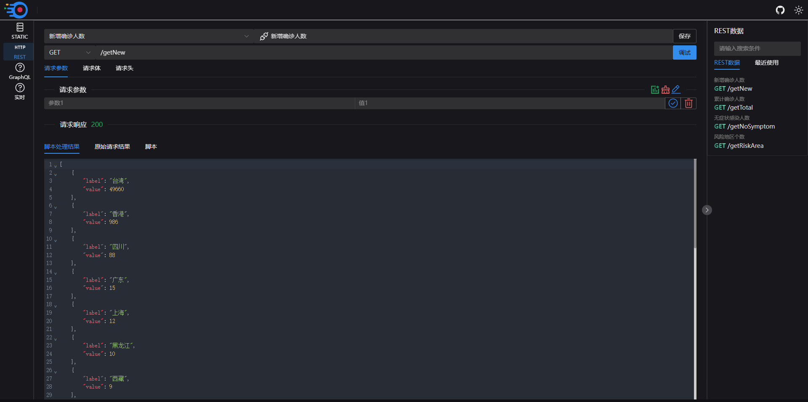
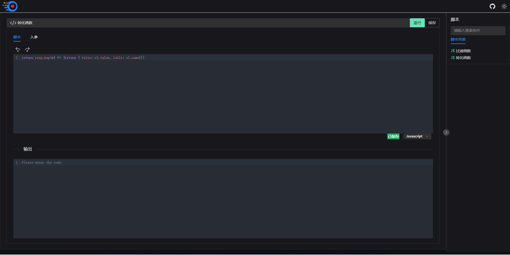

[toc]

平台集成了`通用数据`管理功能，目前已完成`静态数据`和`Rest数据`功能开发


# 静态数据
 

静态数据是指平台提供了一个统一接口用来读取或者存储的数据

 

用户可以在静态页面对平台存储的静态数据进行`修改`、`删除`和`新增`

## 新增与修改

点击静态数据的`原始数据`页签,在代码编辑器里面可以对静态数据进行`修改`和`新增`，点击<x-icon name="save"/>按钮，即可将在`处理数据`页签看到，此静态数据被脚本处理完成之后的效果，点击右上角的保存按钮，即可将此静态书进行更新和保存

## 删除

在右侧静态数据列表中，鼠标右击即可删除对应的静态数据

## 设计思路


> 很多低代码平台的静态数据保存在页面中配置文件中，但是我们无法预测用户配置的静态数据大小，如果将静态数据存储在页面配置文件中，将会导致页面配置文件数据体积增大，进而影响页面渲染速度。

> 静态数据保存在平台后台的话又会带来另一个问题，静态数据在多个组件中被复用时，在某个组件中更改了静态数据内容时所带来的影响是不是可预见的，答案是否定的。

> 我们不建议在组件使用过程中更改静态数据内容，我们可以通过在每个组件中写不同的脚本来适配同一数据源在不同组件复用时数据差异。

> 静态数据的修改应该考虑数据被复用时，对使用的组件效果影响，因此我们将静态数据设计为存储在平台后端，在使用组件使用过程中不可更改，但是在静态数据页面可修改！


# Rest数据

`Rest 数据`是通过`HTTP`接口获取数据,应该是平台最主要的获取数据的方式，一个类似`PostMan`的接口调试




## 跨域拦截

因为浏览器的安全策略，一旦你的接口服务未配置跨域相关安全策略，那么是无法在本平台进行接口调试的，可以跟接口服务开发人员协调，支持跨域访问


## 设计思路

> `Rest数据`页面设计是类似于`PostMan`的作用，但是很遗憾，我们尚未达到`Postman`的效果，目前仅支持`application/json`数据的请求和响应，但是对于`FormData`、`Blob`和`ArrayBuffer`等数据尚未支持

> `Rest数据`的定义数据是可控的，主要是 `url`、`method`、`headers`、`params`、`data`，因此整个 `Rest数据`定义我们是保存在页面配置文件中的，我们支持在`Rest数据`页面增加或者修改接口定义，同时我们也支持在单个组件中添加接口，也就是说你修改任意一接口也不会影响已经在其他组件中被使用的该接口


# 脚本


为了提高组件的`复用性`和接口的`兼容性`，我们提供了脚本功能。




通过脚本你可以将`接口返回的数据`处理成`组件所需要的数据`,这样就你就无需担心你的组件和接口之间的无法兼容的问题。

目前我们的脚本只支持`javascript`,后续将支持`python`，因为`Python`在数据处理方面的先天优势十分的吸引我们，我们希望可以将`Python`的引入，可以和平台碰撞出耀眼的火光。


## Javascript脚本

`Javascript脚本` 我们使用的是js的 `new Function()`特性，因此`Javascript脚本`,你只需要书写函数体本身即可

例如

```javascript
const filterFunc = (resp，options) => {
  return resp.filter(el => el.value > 30)
}

```
你只需要写

```javascript
return resp.filter(el => el.value > 30)
```

`Javascript脚本` 生成函数默认有两个位置参数`resp`和`options`


- `resp`: 需要处理的数据

- `options`: 在组件中使用，默认返回的组件的`propValue`属性


## Python脚本

待实现


