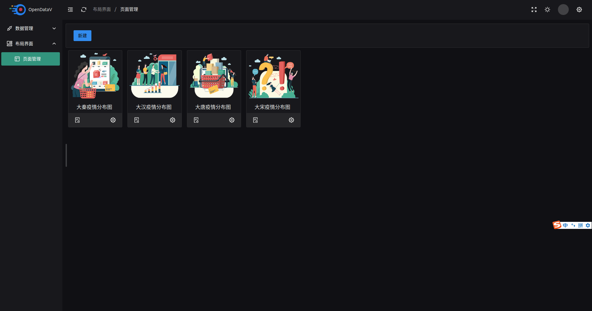
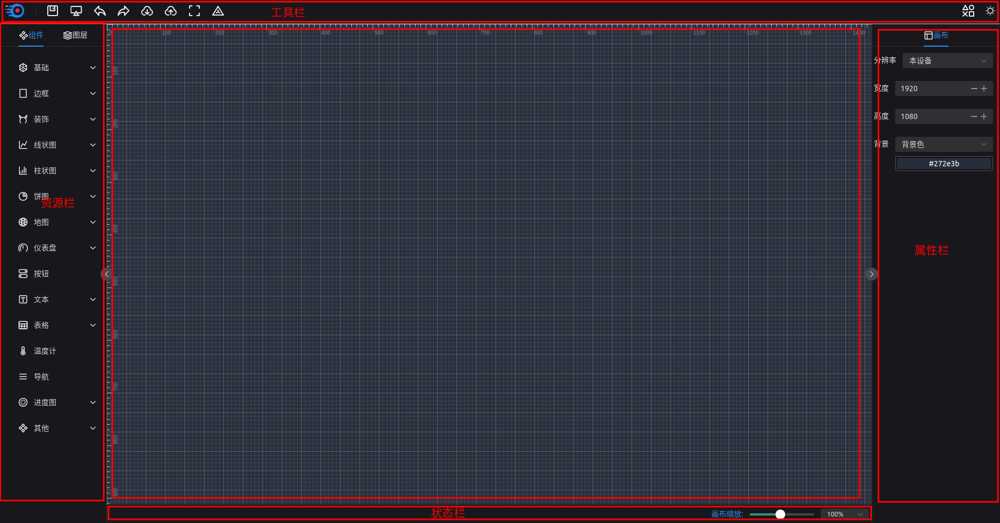
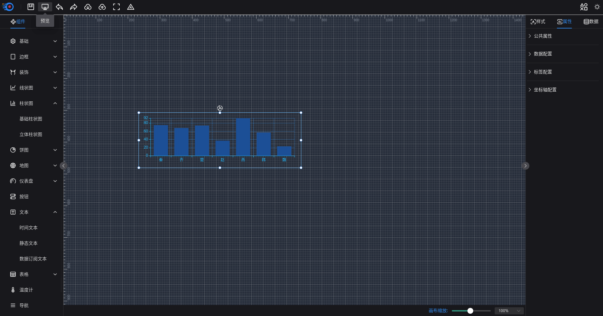
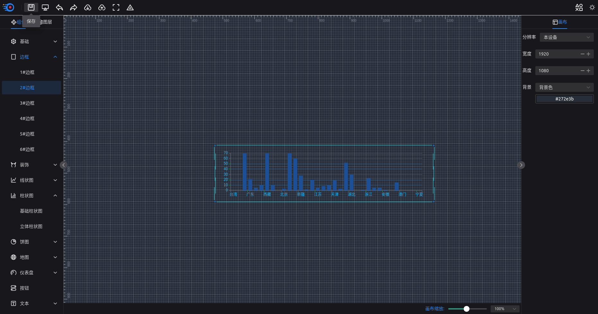

[toc](目录)


  快速创建一个属于自己的页面并发布

# 快速开始

接下来我们将带领大家创建一个页面，来熟悉该低代码平台的使用

## 安装

```Bash
git clone https://github.com/AnsGoo/openDataV.git

npm install pnpm -g

pnpm install
```

## 启动

```Bash
pnpm dev
```

## 编译

```Bash
pnpm build
```


# 访问布局管理

```Bash
/Pages
```



当前会展示出项目已有的页面，你可以点击页面卡片进行查看，也可以对已有页面进行二次编辑，还可以自己新创建一个页面


## 打开创建页面


点击`新建按钮`号会自动进入`创建`页面



整个页面被分为：

- 顶部的`工具栏`：  常用工具按钮
- 左侧的`资源栏`：  组件和图层
- 右侧的`属性栏`：  属性分为组件属性和画布属性
- 底部的`状态栏`：  创建页面的状态
- 中间的`画布`：    承载组件的最顶层容器

接下来我们将开始创建一个页面

                                      
# 添加第一组件

我们设计一个`HelloWord`文本页面

## 拖动组件

我们在左侧`资源栏`的组件中找到`柱状图`->`基础柱状图`组件，并将其拖动到画布中央，并单击鼠标左键选中组件



## 修改组件属性


修改组件下列属性
- 数据配置的大值为`70`
- 坐标轴配置的X网格线`不显示`
- 坐标轴配置的轴线颜色为 `#18A058`


同时我们可以对组件进行`拖动`、`旋转`、`拉伸`

<video muted autoplay="true" loop="true">
	<source src="./img/010.mp4" type="video/mp4" />
</video>

## 配置组件数据

将组件的示例数据改为静态数据，切换组件数据类型，这里我们选择静态数据,并选择具体的静态数据

<video muted autoplay="true" loop="true">
	<source src="./img/011.mp4" type="video/mp4" />
</video>


## 修改组件样式

所有的组件都有`位置大小`的公共样式，主要是用来设置组件的`坐标`、`尺寸`和`旋转`情况，你除过可以通过`拉伸`、`拖动`、`旋转`组件本身来改变这些值以外，还可以通过公共样式`位置大小`来精确更改。
这里我让将组件旋转状态改为0

<video muted autoplay="true" loop="true">
	<source src="./img/012.mp4" type="video/mp4" />
</video>

# 组件间的操作

我们向画布中追加一个边框组件



## 选中

这里我们通过框选，选中`边框`和`柱状图`

- 框选

<video muted autoplay="true" loop="true">
	<source src="./img/020.mp4" type="video/mp4" />
</video>

- ctr + '鼠标单击'

<video muted autoplay="true" loop="true">
	<source src="./img/021.mp4" type="video/mp4" />
</video>

- 通过图层选中

<video muted autoplay="true" loop="true">
	<source src="./img/022.mp4" type="video/mp4" />
</video>

## 组合

在选中框上右击组合进行组件的组合，这时候两个或者多个组件就被变成一个`分组`组件

<video muted autoplay="true" loop="true">
	<source src="./img/023.mp4" type="video/mp4" />
</video>


## 拆分

我们也可以通过选中分组组件，然后鼠标右击对`分组`组件进行`拆分`

<video muted autoplay="true" loop="true">
	<source src="./img/024.mp4" type="video/mp4" />
</video>


# 图层编辑

图层是组件的层级关系，越是靠近顶层的组件图层级别越高，组件图层级别高的可以遮盖图层级别低的组件，图层级别高低关系着组件的渲染顺序，从而影响用户页面的`视觉效果`(比如一张图片覆盖了另一张图片)和`交互效果`(点击效果无法触发)等；点击左侧`资源栏`一列的图层即可看到我们画图中所有组件之间的图层关系，默认组件的名称就是图层的名称。

## 更名

选中组件之后，每一个组件的都有属性一栏都有一个`公共属性`,可以通过更改`公共属性`的`名称`一栏来修改图层名称


## 移动

可以通过选中组件来，然后鼠标右击菜单栏里面的`置顶`、`上移一层`、`置底`、`下移一层`来更改组件的图层顺序

<video muted autoplay="true" loop="true">
	<source src="./img/025.mp4" type="video/mp4" />
</video>


也可以通过`图层`一栏，鼠标右击的菜单栏里面的`置顶`、`上移一层`、`置底`、`下移一层`来更改组件的图层顺序

<video muted autoplay="true" loop="true">
	<source src="./img/026.mp4" type="video/mp4" />
</video>


还可以通过拖动组件到对应的位置来修改图层顺序

<video muted autoplay="true" loop="true">
	<source src="./img/027.mp4" type="video/mp4" />
</video>

## 隐藏、显示


在`图层`一栏，通过在图层上鼠标右击菜单栏里面的`显示`\\`隐藏`来显示或者隐藏组件,需要注意的是显示或者隐藏组件只是在画图中组件较多时，通过隐藏组件来减少画布中组件数量，便于用户编辑组件，在非编辑模式下无任何效果，只对编辑模式有效

# 修改画布

## 分辨率

我们支持针对不同的分辨率的设备，当设备分辨率比差异较大的情况下，可以通过指定分辨率使设计出来的页面达到最好的效果

## 页面背景

默认页面使背景色，我们支持页面修改为`背景色`、`渐变色`、`背景图`

<video muted autoplay="true" loop="true">
	<source src="./img/028.mp4" type="video/mp4" />
</video>

# 预览并发布

当我们完成页面的设计，我们可以通过`工具栏`里面的预览按钮去预览一下页面效果效果，也可以通过`保存`按钮来保存我们的页面，还可以通过`导出`按钮将我们页面设计在本地进行保存。

<video muted autoplay="true" loop="true">
	<source src="./img/029.mp4" type="video/mp4" />
</video>


至此一个简单的页面就设计完成了！


